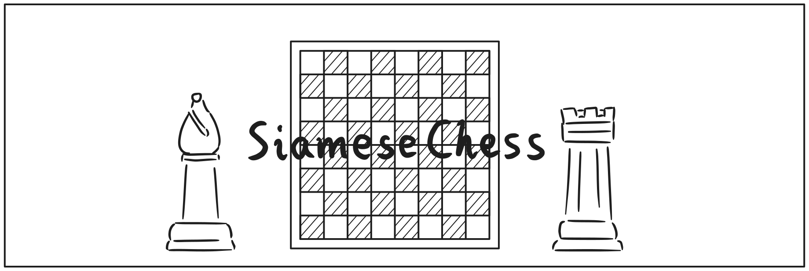

# SiameseChess（暂名）

基于Godot的国际象棋程序，但不仅仅是象棋。

## 目的

这是之前的项目大幅度改动后衍生的产物，也就是“从错误中诞生的项目”。

虽然看起来像策略游戏（或者叫战棋），我需要从头到尾都强调一下，这是解谜冒险游戏。

对于战斗环节，为了发扬国际象棋自身的趣味性及艺术性，在常规战斗关卡设计中，会多围绕国际象棋自身已有的战术来设计。不考验运营和培养之类策略游戏特有的能力，而是纯粹的计算。

项目自身可拓展性质，外加游戏自身可以做成沙盒，故将这一项目开源，以巩固生态（疑似想得有点远了）

和SiamesePiano一样，分几步走：

1. 完善基本的国际象棋规则，添加AI棋手；
2. 扩展棋子种类、添加额外的规则、设置好不同的关卡布局、以及指定不同的游戏目标；
3. 棋盘以外的内容。

## 开发计划

吸取此前的教训，这次我公开一下文档，欢迎各位一同探讨机制可行性。目前写有的文档有：

- [游戏机制](docs/mechanic.md)
- [关卡](docs/level.md)
