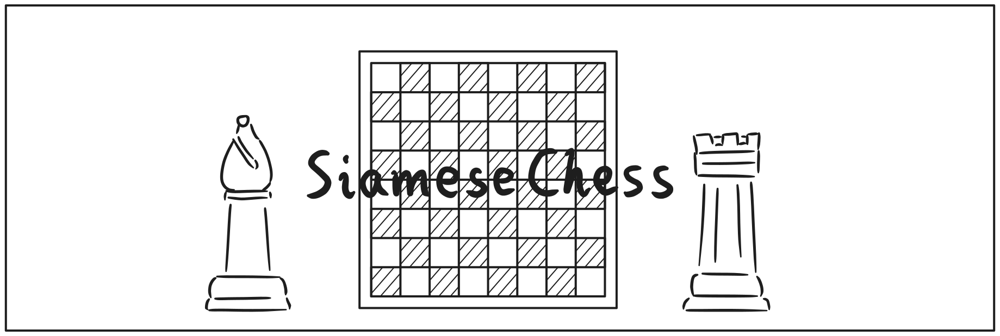

# SiameseChess

使用Godot Engine和C++编写的国际象棋电子游戏，但不仅仅是象棋。

## 这是什么？

- 这是一款解谜冒险类游戏，里面包含了不同的场景供玩家探索，并且以国际象棋形式战斗，发现游戏世界中的秘密。
- 游戏中的棋盘、棋子等物体，均以3D模型的形式呈现。
- 为了能让战斗场景的呈现更加多样化，游戏将会对标准的规则进行适当改编。
- 同时为了保有国际象棋自身的趣味性和艺术性。改编后的规则也需要兼容原版的规则。这意味着玩家可以在该游戏中体验到原汁原味的象棋游玩体验。
- 为了适应改编规则，游戏还内置了自主编写的国际象棋引擎，而非使用现有的象棋引擎。

## 为什么是Siamese（暹罗猫）

- 因为作者喜欢猫；
- 游戏中的某一位角色就是暹罗猫。

## 构建需求

您需要准备以下工具：

- Godot 4.5
- GCC
- Scons

和编译Godot Engine时所需工具一致。您必须准备好上述的开发环境，编译好对应的C++动态库，游戏才可以运行。不要忘记克隆子仓库godot_cpp。

建议：对于Windows平台，使用scoop，以获得和作者一致的GDExtension开发环境。

## 运行

- 可以在项目文件scene/level中选择任意一个场景运行；
- 在项目文件scene/test中所有的场景用于技术性的测试，例如象棋规则正确性的测试perft_test.tscn，3D角色的运作actor_stage.tscn等。

## 参考

- 国际象棋引擎中的评分数值参考了另外一款引擎Sunfish；
- 国际象棋相关的许多开发技术，均参照了[ChessProgrammingWiki](https://www.chessprogramming.org/)以及[象棋百科全书](https://www.xqbase.com/)；
- 对上述的创作者予以感谢。
