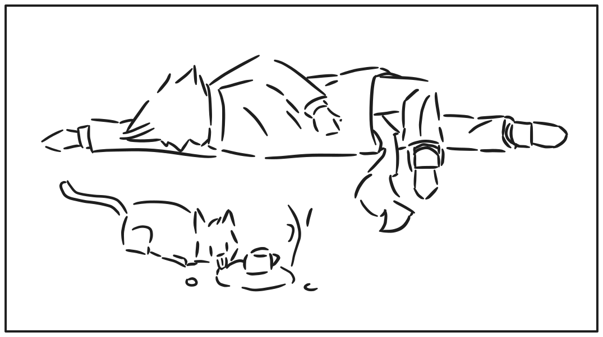

# 关于咖啡

玩家（Lotus，也叫Cheshire）在咖啡厅中下棋，通过菜单选择任意一杯咖啡下单。在检查桌旁的咖啡时，触发这一段对话。

《孤芳》世界观中，喝咖啡会不会死，取决于不同作者对于“猫狗能否喝咖啡”的认知。至少在Yulan（Pastor）的世界观中，喝咖啡是不会死的。

Lotus: 说来，咱们像这样若无其事地喝咖啡，真的好吗？

Yulan: 怎么，难不成您要把它当水喝？

Yulan: 您也不是多小一只猫吧，我们这里的饮食习惯，除非是猫狗本身、虫子……

他顿了一会，思索还有哪些对他而言难以接受的食物，但又想到这是个人喜好问题，所以海鲜没有被纳入进来的。

Yulan：……总之基本以人类的为准。这是为了照顾广大读者，降低认知负担而设定。

Lotus（讽刺道）：哦，这意味着你要准备误导读者让他们家的宠物喝咖啡喽？

Yulan：那不会（喝了一口手中的茶，他来咖啡厅点的不是咖啡），至少小猫小狗还是不能喝的。

Yulan：不同人不同看法，我这里喝咖啡倒是安全的，但在别的作者眼中可不一定。

他突然想到了什么，并开始用奇怪的语气反问了起来。

Yulan：不如说，我很好奇您之前不小心“喝”死是什么样的感觉？

Lotus：死得很随机。

你回想起自己此前乱七八糟的过往，感慨起重要往事的同时，也在检索是否有喝咖啡的记忆。

Lotus：有的时候，作为四脚猫，能够喝完一整杯咖啡。

Lotus（跟着喝了一口）：有的时候像我现在这样的身材，喝了一口后心脏突然开始剧烈阵痛，然后，意识开始模糊了。

Yulan（无奈）：像神农氏般，跟个勇士一样喝咖啡。

Yulan：然后用上为数不多的力气，说出自己的遗言，然后壮烈牺牲。

Yulan（捂住心脏，假装自己马上要死了）：遗言就只有一句，“这咖啡有毒！”。

Lotus：那我在你这里也可以是神农氏，只是我这次会说“这咖啡怎么跟喝水一样”。

Lotus：我反而有点好奇你对咖啡的看法是不是这样的。

Yulan（苦笑）：那真是抱歉呢，我一直都无法理解咖啡的风味。

Yulan：虽然是个人喜好，但是咖啡与茶的争论中，我属于茶阵营。

Lotus（无语）：不喝咖啡但是来咖啡厅……

Lotus：我觉得有必要继续审视一下你对咖啡厅的印象是不是有种“精致刻板印象”了。

Yulan（略微得意）：很正常，有的店家也想着要往刻板印象靠拢，号称自己是“第三空间”。

Yulan：比起有些人咖啡厅里拿出昂贵的笔记本电脑做样子，我们在这里下棋讨论可要优雅太多。

他本可以继续扯皮道“国际象棋更有浓厚的文艺气息”，但他开始意识到题外话扯远了，准备把话题带回正题。

Lotus：咱们这更像做样子了啊……

Yulan：必要的优越有利于自己的自信心，也挺好，我们看回棋盘吧。
