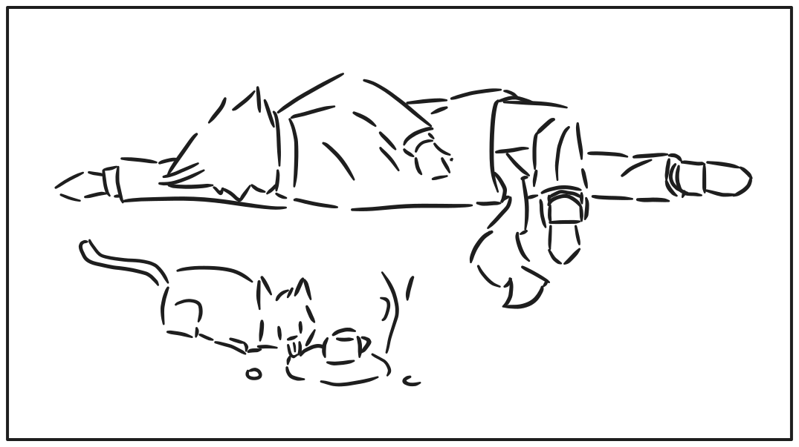

# 关于咖啡

玩家（Lotus，也叫Cheshire）在咖啡厅中下棋，通过菜单选择任意一杯咖啡下单。在检查桌旁的咖啡时，触发这一段对话。

《孤芳》世界观中，喝咖啡会不会死，取决于不同作者对于“猫狗能否喝咖啡”的认知。至少在Yulan（Pastor）的世界观中，喝咖啡是不会死的。

Lotus: 说来，咱们像这样若无其事地喝咖啡，真的好吗？

Yulan: 怎么，难不成您要把它当水喝？

Yulan: 您也不是多小一只猫吧，我们这里的饮食习惯，除非是猫狗本身、虫子……

他顿了一会，思索还有哪些对他而言难以接受的食物，但又想到这是个人喜好问题，所以某些奇怪的海鲜、家禽肝脏之类他不喜欢吃的，就没有提及。

Yulan：……总之基本以人类的为准。这是为了照顾广大读者，降低认知负担而设定。

Lotus（讽刺道）：哦，这意味着你要准备误导读者让他们家的宠物喝咖啡喽？

Yulan：那不会（喝了一口手中的茶，他来咖啡厅点的不是咖啡），至少小猫小狗还是不能喝的。

他突然想到了什么，并开始用奇怪的语气反问了起来。

Yulan：不如说，我很好奇您之前不小心“喝”死是什么样的感觉？

Lotus：死得很随机。

你回想起自己此前乱七八糟的过往，感慨起重要往事的同时，也在检索是否有喝咖啡的记忆。

Lotus：有的时候，作为四条腿的小猫，能够喝完一整杯咖啡。

Lotus（跟着喝了一口）：有的时候像我现在这样的身材，只是舔了一下，心脏就开始剧烈疼痛，然后，就失去意识了。

Yulan（总结道）：仿佛抽奖一般，到时候碰到食物短缺到只剩下咖啡豆的世界，还能算中头奖。

Yulan：不同人啊，对于咖啡都有不同的看法，如同您此前经历的。

Yulan：即使作者没有解释，世界观是存在于每个人的潜意识之中，还是有对应的因果关系。

你尝了下刚点的咖啡，发现了不对劲。

Lotus：还有这咖啡怎么跟喝水一样没味道，按你说法你该不会觉得咖啡就是这样的吧。

Yulan（苦笑）：那真是抱歉呢，我品尝过后还是不太理解咖啡什么风味。

Yulan：虽然是个人喜好，但是咖啡与茶的争论中，我属于茶阵营。

Lotus（无语）：不喝咖啡但是来咖啡厅……

对于这种人，你很自然地把他归类到……

Lotus：至少得让你显得像是精致小资。

Yulan：很正常，但是你可别误会了，我原本在等另外一位朋友来和我下棋的。

Yulan：而且比起有些人咖啡厅里拿出昂贵的笔记本电脑做样子，我们在这里下棋讨论可要优雅太多。

他本可以继续扯皮道“国际象棋更有浓厚的文艺气息”，但他开始意识到题外话扯远了，准备把话题带回正题。

Yulan：必要的优越有利于自己的自信心，也挺好，我们看回棋盘吧。
