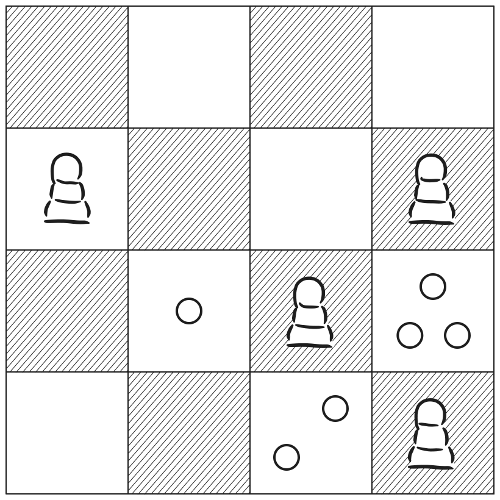
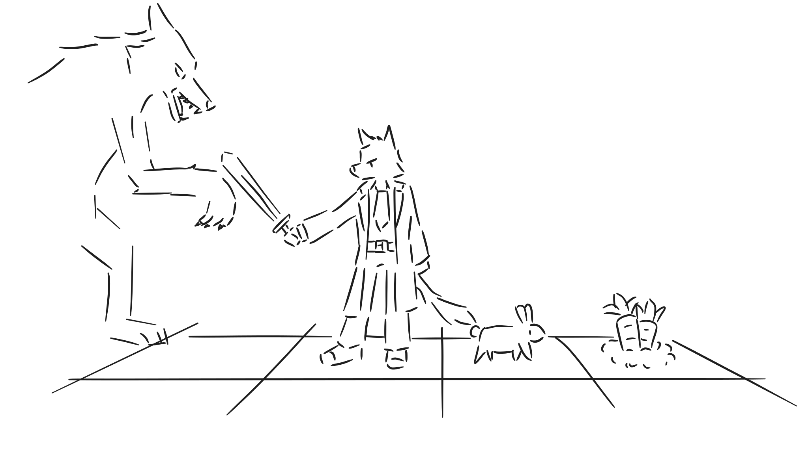

# 关卡

## 介绍

- 这里着重描述关卡设计，设计背景、细则以及思路将会写在这里。

## 沙盒

- 方便测试起见，玩家可以同时控制黑白双方；
- 玩家可以通过环绕视角自由观察棋盘；
- 可以自由选择规则和布局，直接编辑棋盘状态；
- 可以实时显示着法评分，这时AI会进行无限制的搜索；

## 标准模式

- 以标准的国际象棋布局进行比赛，但玩家固定为黑方，用于适应规则；

## 西洋跳棋

- 以波兰规则为准的西洋跳棋；
- 跳棋的棋子基于“棋子”而非“资源”类，为了方便区分两者，分别称呼为卒，以及筹码；
- 升变时，将筹码垫在卒的下方，视作为王。

## 王兵残局

- 仅由王和兵构成的残局布局。含有多种关卡布局；
- 部分关卡目标是守和，还有部分关卡目标是争胜；
- 隐藏目标：根据场地信息，让部分棋子走出指定的兵型，部分关卡前几回合不受白方干扰。

## 动物棋

- 一种模拟原始混沌生态的棋类游戏。
- 白方有各种各样的动植物，走法比较多样，黑方棋子只有一颗走法类似于“王”的棋子，代表人；
- 棋盘状态包含有黑方的饱食度；
- 白方的动物分成一级消费者（简称一级）和二级消费者（简称二级）；
	- 一级可以吃固定在场地中的植物，二级吃一级；
	- 这意味着，白方可以吃自己的棋子。
- 黑方能够通过吃掉植物以及一级增加饱食度；
	- 二级消费者可以杀死，但由于高级消费者的肉质较差，无法增加饱食度；
- 一级和植物无法吃掉黑方，但二级可以，所以请小心应对；
- 保证自己能够活着撑过一天的时间，就算黑方胜利，否则算白方胜利。
- 隐藏机制：白方只能选择一颗棋子，其走法由“动物本能”决定。
	- 动物本能：当前棋子只会走出局部最佳着法，搜索层数为1层，尽量保证自己活着并且能够吃一次食物，可以认为其策略非常短视。
- Pastor的计算会尽量让黑方无法填充饱食度，
	- 例如有一颗植物、一颗一级、一颗二级，那么白方会优先让一级吃植物，让二级吃一级，使得黑方没有食物可吃。
