# 机制

## 介绍

- 基于国际象棋形式的游戏世界；但是游戏类型为解谜，而非国际象棋变种；
- 玩家扮演黑猫Cheshire，执黑；暹罗猫Pastor执白参与游戏；

## 阵营

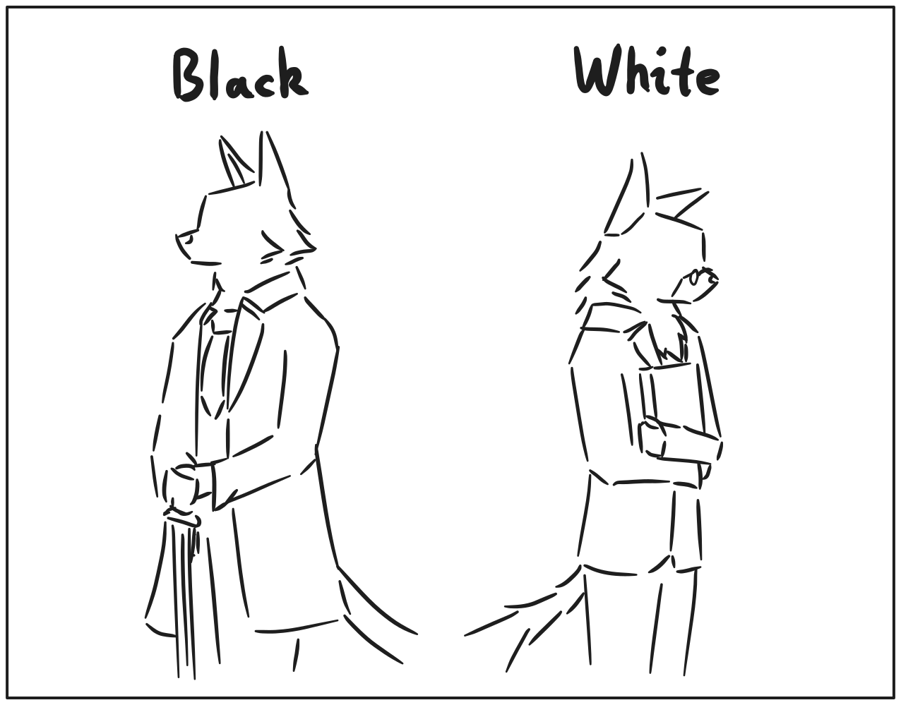

- 主要有黑白两方阵营，棋子也使用黑白表示；
- 双方都能共有绝大多数的棋子种类；
- 实际棋盘布局中，双方强度不对等，部分棋盘黑方优势，也有部分是白方优势；

## Cheshire（玩家，黑方）

- 可以使用手势控制视角；
- 操作棋子时需要对准棋盘方格进行操作；

## Pastor（对手，白方）

- 承担裁判任务，在计算着法的顺便，计算玩家在规则内允许的着法；
- 裁判包含了送将判定、王车易位合法性判定（等同于送将）、棋局结束判定等；

## 回合制

- 玩家一个回合内只能够操作一个单位；
- 白方先手，黑方后手；
- 仅出现其中一方阵营时，仍然计回合数；
- 不允许跳过回合，可能会出现“楚茨文克”局面；

## 棋盘

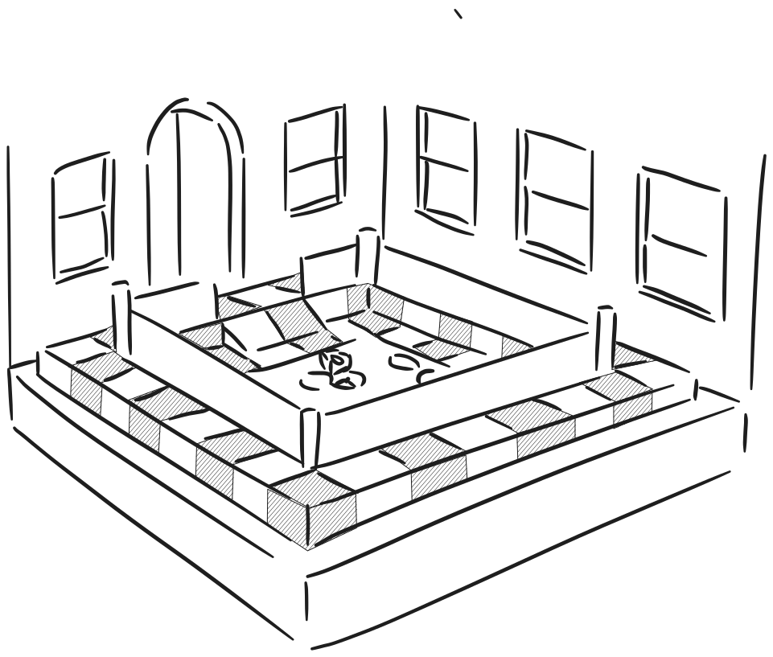

- 8 * 8正方形网格，基底与国际象棋棋盘类似；
- 棋盘周围有坐标标注；
- 颜色较浅，以灰白色为主，便于显示草稿和指令线条；
- 存在有高低差、墙壁等一类地形，影响到玩家移动，绘制线条等；
- 以3D模型形式呈现；
- 任何可移动的棋子都可以跳转至其他棋盘；
- 不同棋盘场景，对于棋子的动作会有不同反应；
- 制作棋盘时，需要使用Area3D指定每个格子的高度，以及点击的碰撞形状；
- 棋盘可以保存一些全局的状态、例如吃通路兵的格子、以及易位时的经过格子；
- 也可以是规则特定内容、例如地形信息；

## 棋子

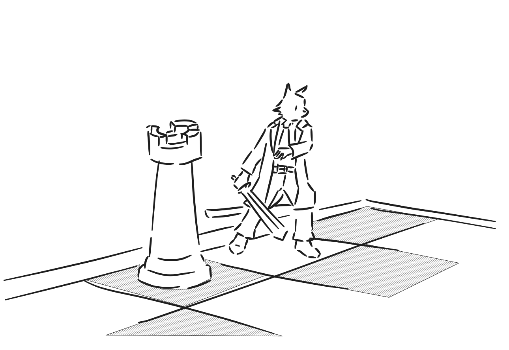

- 包含了玩家、敌人、中立角色、道具等；
- 多个棋子不能挤在同一格子上；
- 玩家可以双击棋子查看详情和帮助文档；
- 由于记谱问题，且为了控制游戏复杂度，棋子自身没有状态，只会凭场景行事；

## 棋盘连接与出入

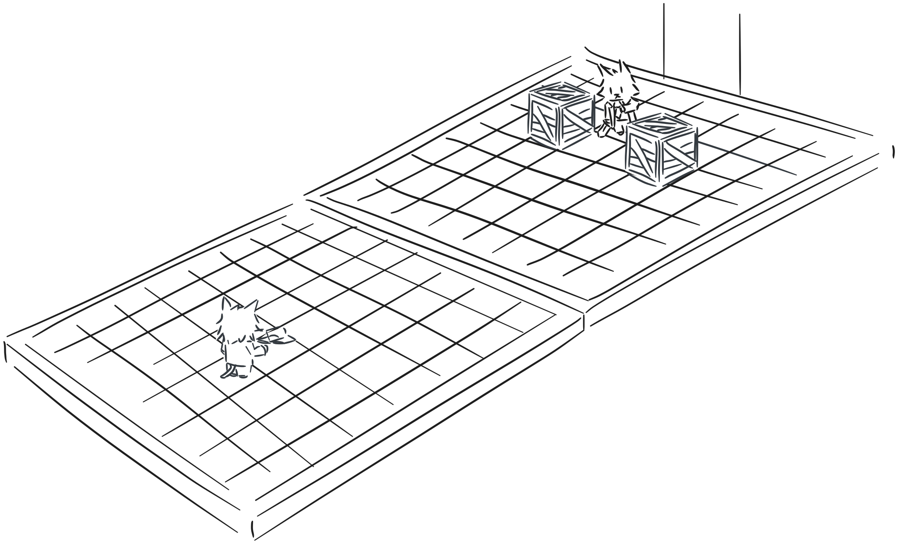

- 棋子走向特定格子时会穿梭到其他棋盘中；
- 棋子可能会从不同入口进场；
- 如果存在多个棋子进入场景，以至于被堵在门口时，第一个进入的棋子在门口位置，后续的棋子摆放在边缘位置排队；
- 当门口位置的棋子移开时，队列中最前面的棋子会离开队伍，来到入口位置。
	- 可以多利用一下由这个机制衍生出来的战术。

## 并行对局

- 只要桌子足够大，玩家可以同时摆放多个棋盘在桌上；
- 只要存在两个不同阵营的棋子，那么当前棋盘将要求两位棋手轮流落子。
- 只要场上有其中一个棋盘轮到玩家，计时器将会计时下去；

## 吃子

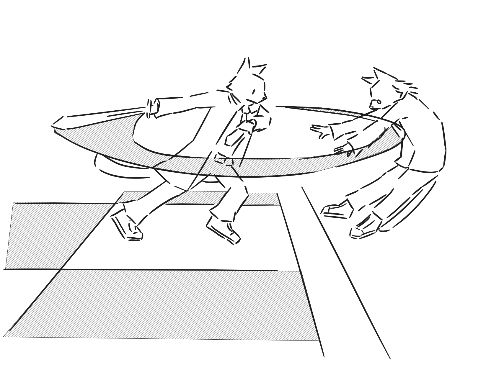

- 当前棋子在规定范围内可以攻击其他棋子，实现吃子；
- 不能攻击同阵营的棋子；

## 升变

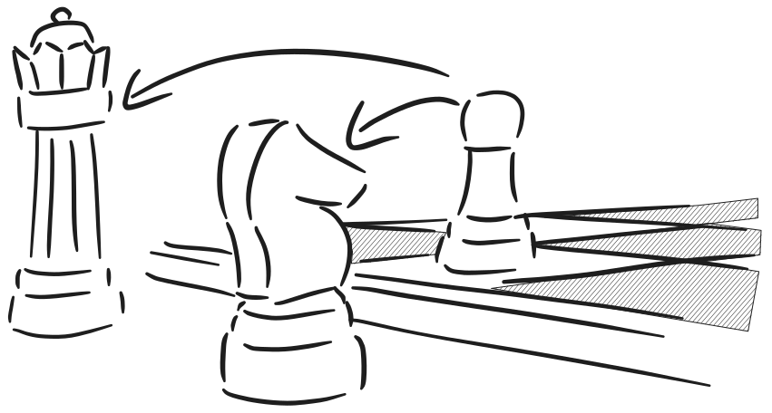

- 与国际象棋一致，兵走到底线后会出现升变现象；
- 由于谜题布局较为开放，极大可能会出现通路兵，升变情况会更频繁；
- 除了传统的马、车、象、后以外，还可以变成游戏特有的棋子；
- 升变时，兵会直接转变成存储中指定的棋子，而存储的棋子不会被消耗；

## 着法

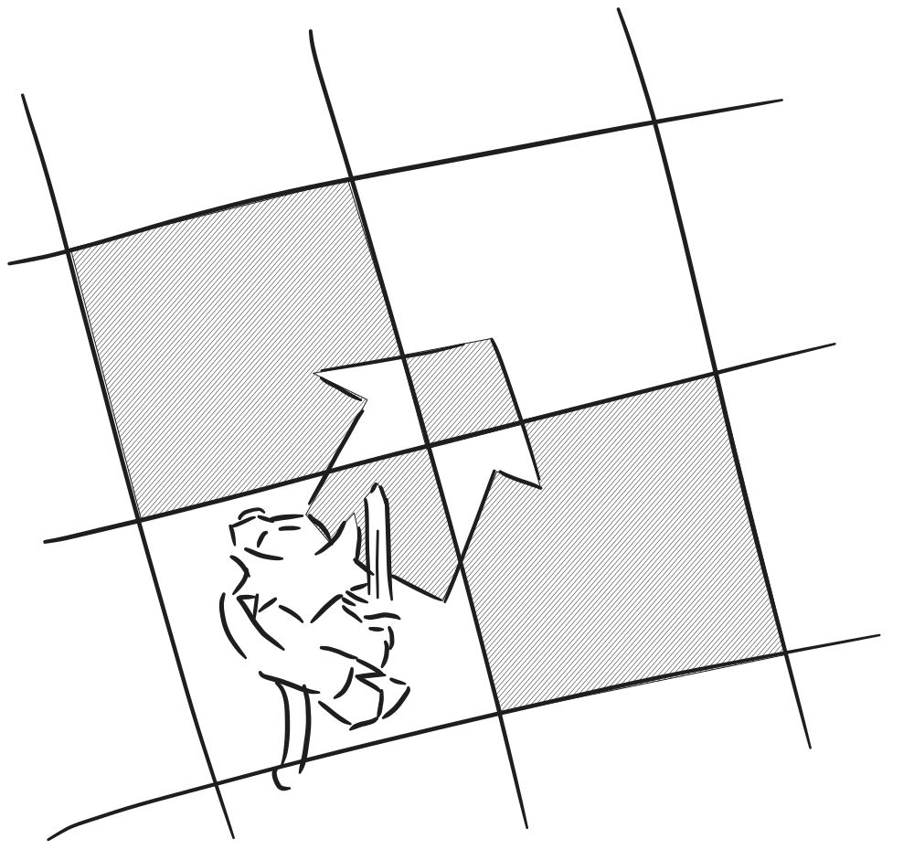

- 可以通过点击、滑动来确定着法；
- 一回合只能够指定一颗棋子，指向一次方向；
- 点击当前棋子或者拖动时，会展示所有合法操作，用高亮方框表示能指向的格子；
- 不同棋子能够指向的格子和实现的效果可能不同，例如王车易位会牵扯其他棋子移动；
- 指向合法检测，包含了棋子本身的位置检测，以及场景本身检测能否前往，不好总结，但包含了一些情况：
	1. 王车易位中的的限定规则（没有易位过、王易位前后不能被将军、经过格子不在攻击范围、中间无其他棋子、王和车需要在同一位置）
	2. 王被将军必须应将（遮挡、跑王、吃掉攻击的棋子）
	3. 被己方、对方棋子遮挡，但可以吃对方棋子
	4. 兵的开局进两步
	5. 吃过路兵（对方上一步必须是兵开局走两步）
	6. 王无法走向被控制的格子
	7. 被场景中的墙遮挡
	8. 兵的直走斜吃

## 同种着法额外选项

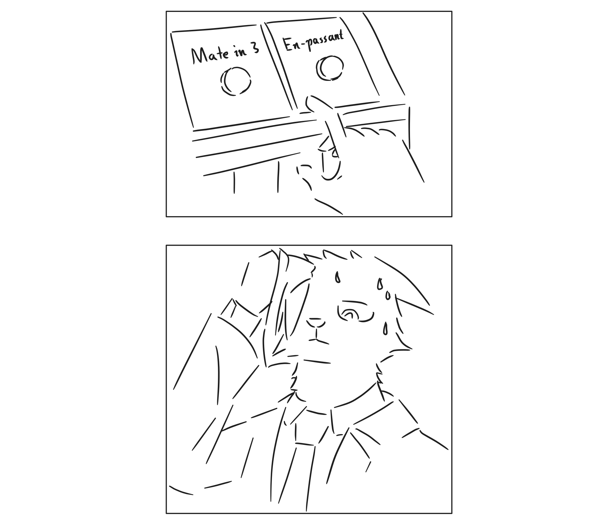

- 由于我们需要处理兵的升变、以及比较诡异的王车易位，特此在着法上增加此类信息；
- 额外信息仍然是通过规则生成的，玩家无法自行填入；
- 若起点和终点相同，但实际导向结果不同时，则视作出现冲突，此时系统将会提供多种选项，例如升变时可以变后、车、马、象；
- 表现形式上，由于SiameseChess的叙事占比不小，可以利用故事对话框架中的选项来显示这些决策。

## 草稿

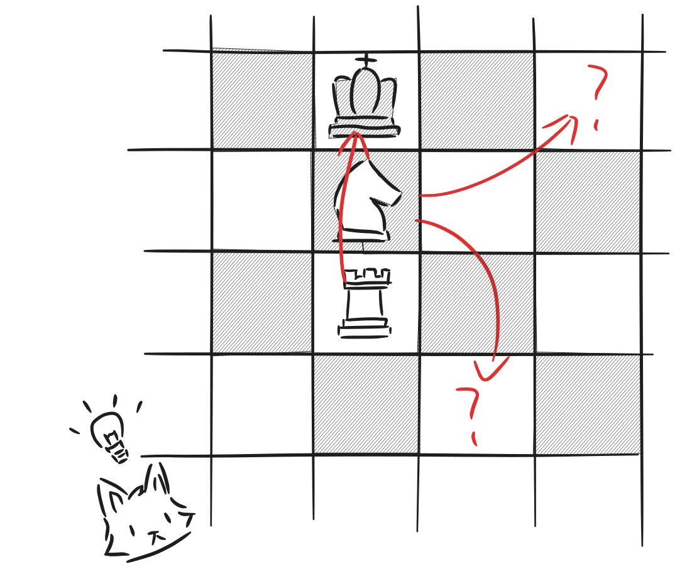

- 可以加载指定草稿，“贴”在棋盘上；
- 允许绘制自由线条，同时以线条形式保存，以线条为单位进行擦除；
- 由于棋盘有高度差，草稿需要单独作为一个图层，绘制优先级为最高；
- 支持手写笔和压感；
- 支持文字输入；

## 棋钟

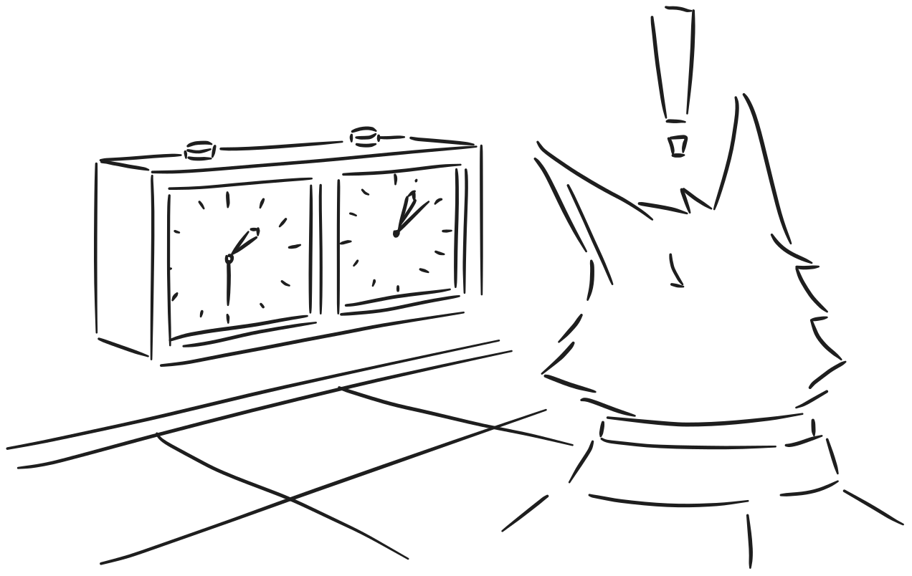

- 取决于关卡设计需求，通常情况为正计时；
- 部分情况为倒计时，对双方计时；
- 可设置自动确认或手动确认；
- 白方Pastor也需要足够的思考时间，倒计时较少，或许可以使用拖延战术击败他。

## 悔棋

- 每次悔棋都可以撤销到落子之前的状态；
- 新游戏时，玩家可以自愿选择关闭悔棋以及不限次数悔棋；
- 黑方无法通过悔棋补偿时间，但是白方能够因为对方悔棋，将自己的倒计时回退到上一步的状态；
- 这意味着悔棋所消耗的时间是黑方单方面的损失。

## 棋谱

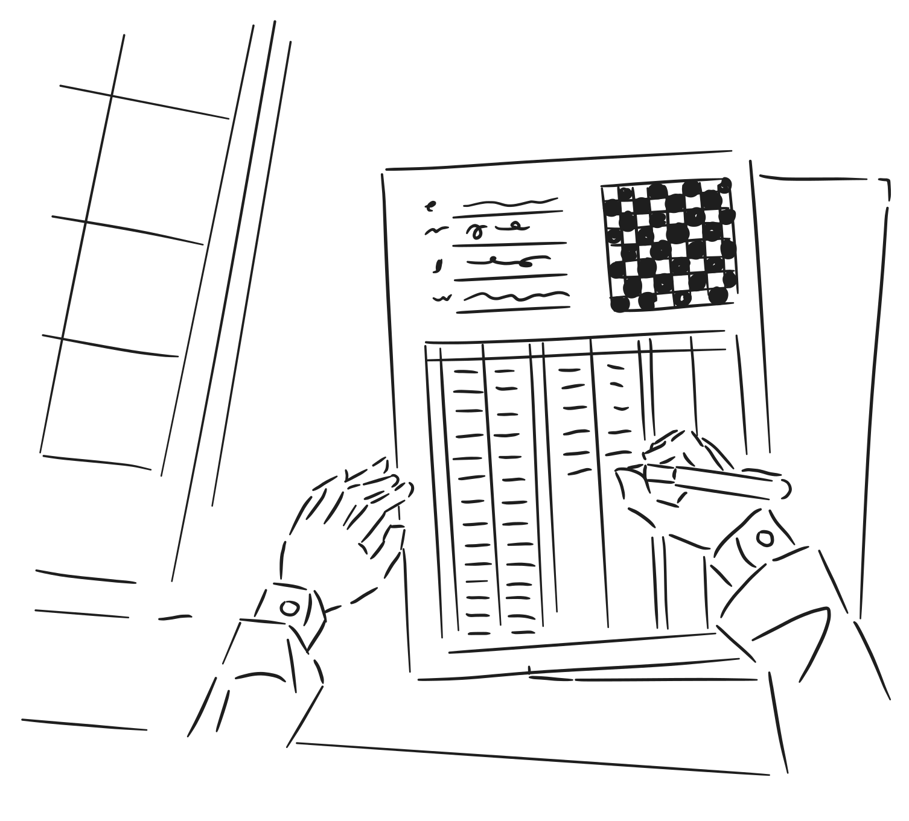

- 用于记录双方在当前棋盘中的对局过程；
- 一份棋谱中主要保存了以下这些信息：
	1. 场上拥有棋子及其初始位置；
	2. 着法；
	3. 思考时间；
- 玩家在切换新的棋盘并下出第一步棋时，开始记录棋谱，离开时棋谱仍然保留；
- 棋谱中记录的时间，以“上次落子时的刻度”和“这次落子时的刻度”之间的时间差为准。
- 玩家可以随时查看历史棋谱记录，甚至可以看到Pastor对于每一步棋的评价。
	- 当然，正在进行中的对局他暂不评价。

## 局面记谱法

- 使用类似于FEN记谱法的方式，用较短的字符串表示出完整的局面；
- 其中包含了地形信息、棋子信息、全局规则等内容；
- 26个字母基本不够用，拓展的棋子可以使用单个Unicode来记录，意味着我们可以使用中文字符表示一颗棋子；
- 注意使用不同的字符来表示对应阵营，例如中国象棋中的“帅”与“将”、“兵”与“卒”、“士”与“仕”……
- 字符和对应实际棋子需要有字典映射，键为字符缩写，值为棋子对应的GDScript文件。
- 映射将会写在user://位置上，方便大家进行拓展，不过小心冲突，届时将会解决多种映射的问题。

## 目标

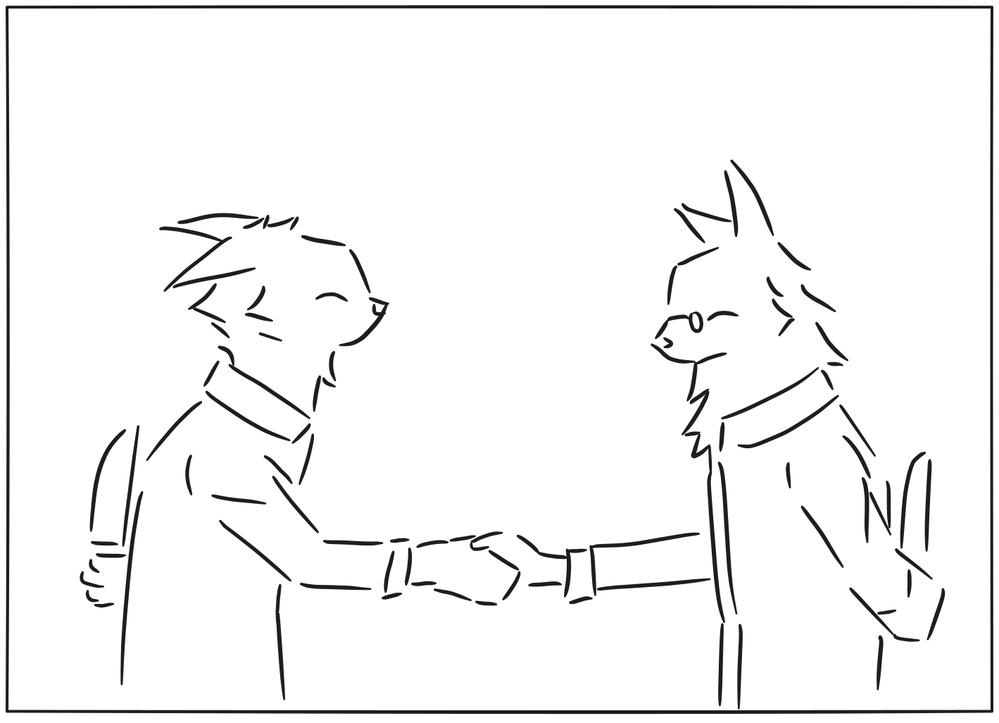

- 游戏为解谜游戏，设计关卡时小心别设计成策略游戏；
- 对于玩家来说，目标可以是将杀对手，也可以是突进到某一格，也可以是推箱子之类的解谜小游戏，甚至之前项目的……
- 玩家遇到被将杀之类任务失败的情况时，可以通过重置、悔棋（如果有）的方式回退到前面的状态；
- 设立与国际象棋一致的强制平局，例如长将、逼和、超50步、双方子力不足等。可以主动使用重置以重新对局；
- Pastor和Cheshire俩人并没有什么深仇大恨，咱们下棋目的就是促进友谊的啦！

## 地形

- 地形机制会影响到棋子着法的合法性、落子后对棋子本身以及场地的影响等
- 格子之间的缝隙可以设置墙壁阻挡棋子：
	- 对于斜线行走，只需要在左右其中一侧设置墙壁，都会阻止其行走，这一个规则会防止象和后穿过直排墙壁；
	- 对于马，需要能够完全阻挡“走日字”的线路，并且墙自身的高度足够高，才能够阻止马前行。
- 高低差机制：
	- 向上高度过高时会阻止其行走，包括马；
	- 向下行走没有任何限制；
	- 车、象、后作为能够伸展到无限距离的单位，允许其逐步向上爬坡；
	- 马作为可越子单位，走一格时能够上升更高的高度。
- 完全禁止行走，或者限制特定棋子的格子：
	- 例如水池。

## 关卡

- 既然是解谜游戏，那肯定得有一大堆精心设计的关卡布局在里面；
- 采取类似FEN记谱法的方式，将关卡保存成一条字符串（并保存成Godot资源）

## 规则分类

- 为了实现地形、目标等花哨内容，特此设置规则分类
- 区分为棋子规则（用于生成着法）、场地规则（设置地形或机关）、评分；

## 将军、将杀与逼和

- 某一方的着法，导致了如果再走一步就能够吃掉对方王时，那么这方的着法会被视为“将军”；
- 如果被“将军”时，对方任何着法都无法挽救王被吃的情况时，视为“将杀”，确定游戏胜负；
- 如果对方任何着法会导致王被吃，但是查询空着时王无法被吃，视为“逼和”，强制和棋。
- 将杀对方导致棋局结束时，玩家可自由探索当前棋盘剩余地区。

## 环境

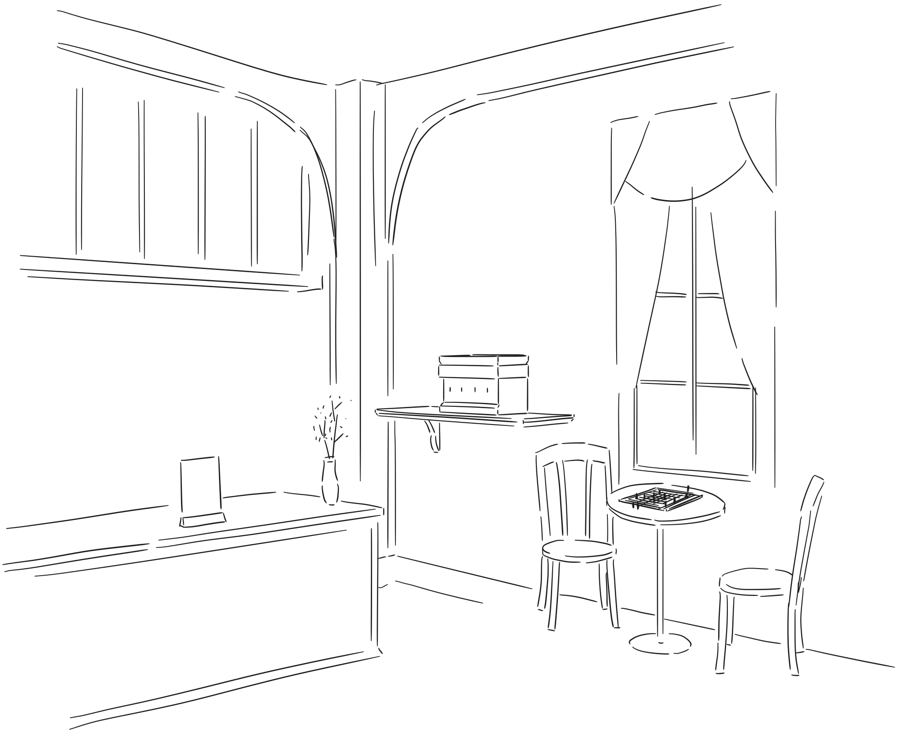

- 特指棋盘之外的环境，包含了棋盘本身、棋钟、对手Pastor、玩家Cheshire、以及周围的布景；
- 下棋的环境是多变的，可能是咖啡厅、可能是酒馆、也可能是审讯室；
- 玩家无法离开棋盘，不过可以控制镜头，直接点击以拉近观察桌面上的事物；
	- 形式上确实很有《The Rooms》的味道，大概吧……
- 毕竟下棋不是过家家，有些心事……还得在棋盘外讲讲，你我之间。

## 博弈树

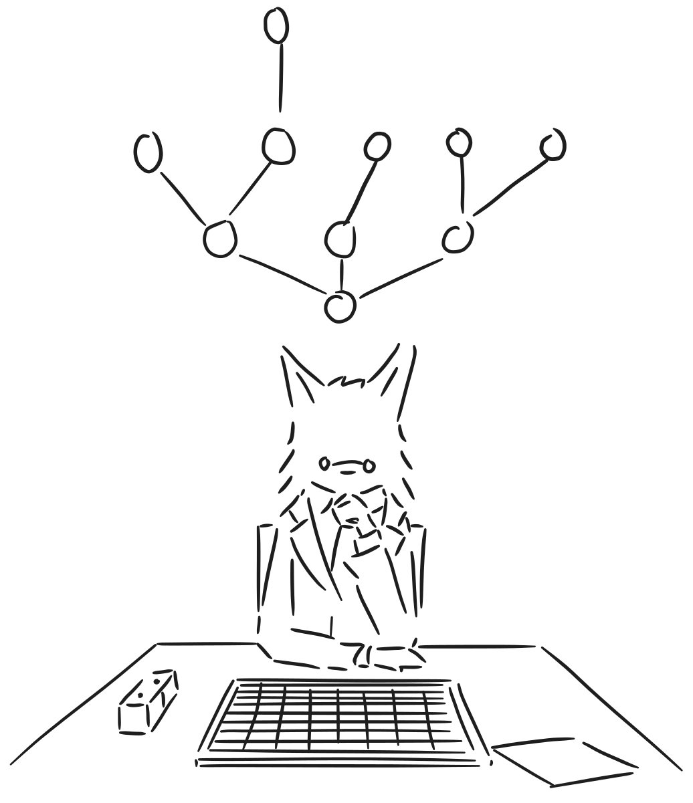

- 这一条将会描述游戏AI的具体实现，但是也会要求玩家穷尽所有着法（含剪枝规则），以解开更深层的谜题；
- 简单来讲，对于Pastor，他会以当前思考能力下最优策略进行决策；
- Pastor会深搜可能的着法，深度有限，同时对于局面评分明显过低的着法进行剪枝，除非被迫落子；
- 局面评分以棋盘中所有棋子评分之和为准，白方棋子为正数，黑方棋子为负数；
- 为了启发搜索以及逼和判定，博弈树会包含“空着”的搜索——通过探讨某方跳过后局势如何发展。

## 盘外招

- 比较遥远的饼，看着乐；
- 玩家在棋盘之外完成一些活动，在游戏棋局内获得一些增益；
- 举个例子：喝咖啡可以让时间流速稍稍变慢一些。
