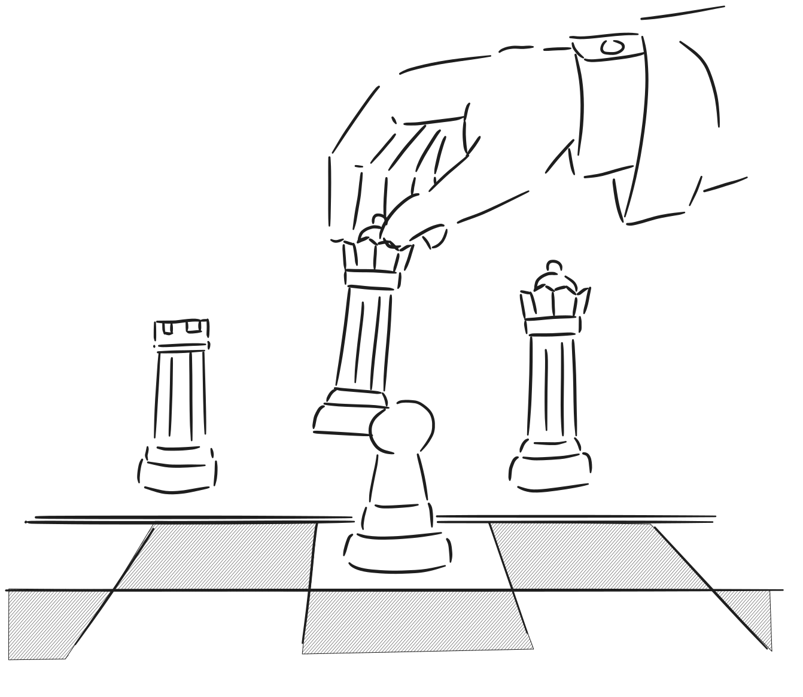
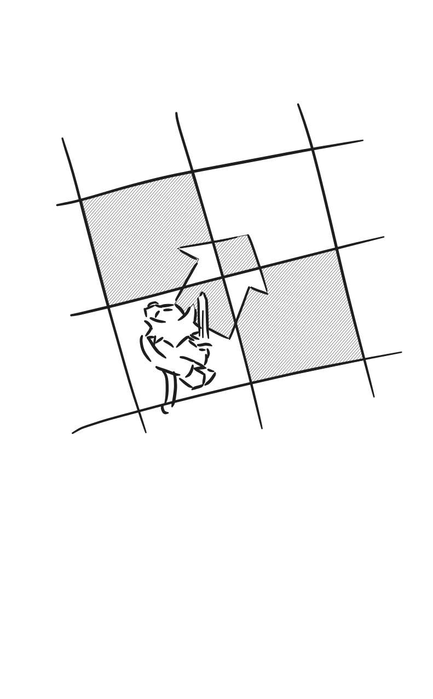
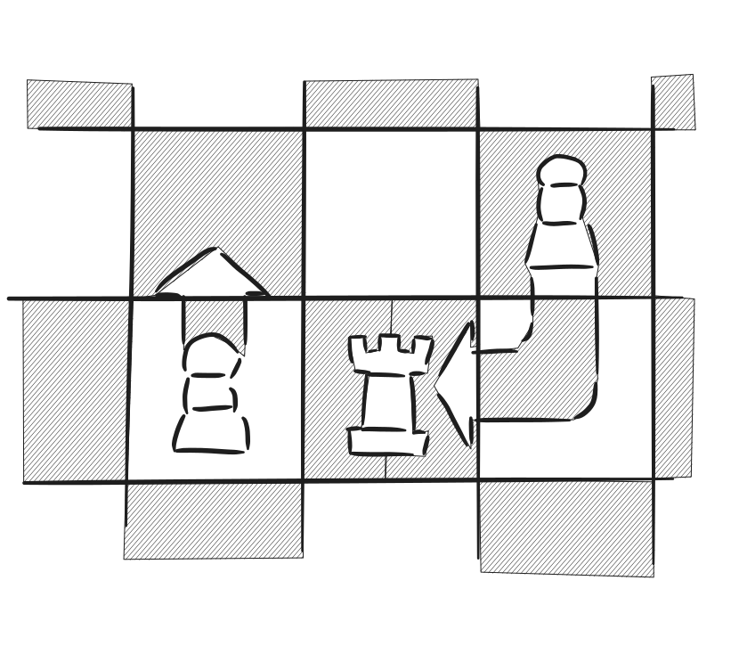

# 机制

## 介绍

- 基于国际象棋形式的游戏世界；但是游戏类型为解谜，而非国际象棋变种；
- 玩家扮演黑猫Cheshire，执黑；暹罗猫Pastor执白参与游戏；

## 阵营

- 只有黑白两方阵营，棋子也使用黑白表示；
- 双方都能共有绝大多数的棋子种类；
- 实际棋盘布局中，双方强度不对等，部分棋盘黑方优势，也有部分是白方优势；

## 回合制

- 玩家一个回合内只能够操作一个单位；
- 虽然你可以绘制多条线条，但是一回合仅应用于一个单位，其他操作视作预先走子；
- 白方先手，黑方后手；
- 仅出现其中一方阵营时，仍然计回合数；
- 不允许跳过回合，可能会出现“楚茨文克”局面；

## 棋盘

- 8 * 8正方形网格，基底与国际象棋棋盘类似；
- 棋盘周围有坐标标注；
- 颜色较浅，以灰白色为主，便于显示草稿和指令线条；
- 存在有高低差、墙壁等一类地形，影响到玩家移动，绘制线条等；
- 以3D模型形式呈现；
- 访问部分棋子或者位置可以跳转至其他棋盘；
- 不同棋盘场景，对于棋子的动作会有不同反应；
- 切换场景时，玩家可能会从不同位置进场；
- 棋盘自身携带有输入输出，取决于对应空地位置；
- 制作棋盘时，需要使用Area3D指定每个格子的高度，以及点击的碰撞形状；

## 棋子

- 包含了玩家、NPC、道具等；
- 棋子存在朝向的说法，以棋子自身实际逻辑为准，例如白方棋子永远朝向北方、黑方棋子永远朝向南方；
- 多个棋子不能挤在同一格子上；
- 玩家可以单击棋子查看详情和帮助文档；

## 吃子与存储

- 当前棋子在规定范围内可以攻击其他棋子，实现吃子；
- 不能攻击同阵营的棋子；

- 吃子后，玩家可以将被吃的棋子放置到专用的存储棋盘中；
- 由于棋盘本身只有8*8大小，玩家只能够保存64颗棋子；
- 不能够存储兵这一棋子；

## 升变

- 与国际象棋一致，兵走到底线后会出现升变现象；
- 由于谜题布局较为开放，极大可能会出现通路兵，升变情况会更频繁；
- 除了传统的马、车、象、后以外，还可以变成游戏特有的棋子；
- 升变时，兵这一棋子将会被收回，从自己的存储中取出棋子，放置在兵原本的位置上；
- 如果没有存储棋子，则不允许走向底线；

## 指向

- 只允许棋从棋子位置开始指向；
- 可以通过点击、滑动来确定指向位置；
- 一回合只能够指定一颗棋子，指向一次方向；
- 点击当前棋子或者拖动时，会展示所有合法操作，用高亮方框表示能指向的格子；
- 不同棋子能够指向的格子和实现的效果可能不同，例如王车易位会牵扯其他棋子移动；
- 指向合法检测，包含了棋子本身的位置检测，以及场景本身检测能否前往，不好总结，但包含了一些情况：
	1. 王车易位中的的限定规则（没有易位过、王易位前后不能被将军、经过格子不在攻击范围、中间无其他棋子、王和车需要在同一位置）
	2. 王被将军必须解将（遮挡、跑王、吃掉攻击的棋子）
	3. 被己方、对方棋子遮挡，但可以吃对方棋子
	4. 兵的开局进两步
	5. 吃过路兵（对方上一步必须是兵开局走两步）
	6. 王无法走向被控制的格子
	7. 无存储棋子时兵无法走到底线进行升变（特有规则）
	8. 被场景中的墙遮挡
	9. 兵的直走斜吃

- 箭头不能完全挡住棋子，棋子的绘制优先级会比箭头高；
- 箭头应当指向棋盘中实际高低位置；

## 草稿

- 一面棋盘对应一份草稿；
- 允许绘制自由线条，同时以线条形式保存，以线条为单位进行擦除；
- 由于棋盘有高度差，草稿需要单独作为一个图层，绘制优先级为最高；
- 支持手写笔和压感；
- 支持文字输入；

## 棋钟

- 取决于场景，通常情况为正计时，仅对黑方计时作为成绩，白方不计时，目的在于确认着法；
- 部分情况为倒计时，对双方计时；
- 可设置自动确认或手动确认；
- 白方Pastor也需要足够的思考时间，倒计时较少，或许可以使用拖延战术击败他。

## 悔棋

- 每次悔棋都可以撤销到落子之前的状态；
- 新游戏时，玩家可以自愿选择关闭悔棋以及不限次数悔棋；
- 黑方无法通过悔棋补偿时间，但是白方能够因为对方悔棋，将自己的倒计时回退到上一步的状态；
- 这意味着悔棋所消耗的时间是黑方单方面的损失。

## 棋谱

- 用于记录双方在当前棋盘中的对局过程；
- 一份棋谱中主要保存了以下这些信息：
	1. 场上拥有棋子及其初始位置；
	2. 双方开始拥有的存储棋子；
	3. 落子位置；
	4. 确认着法时的思考时间；
- 玩家在切换新的棋盘时开始记录棋谱，离开时则停止记录棋谱；
- 与棋谱有关的规则影响有：王车易位、吃过路兵。

## 送将

- 正常象棋规则中，王不能站在对方的控制范围内，否则会被视为“送将”，游戏将不会允许这种行为；
- 判定方式：移动后进行BFS查找，如果对方能够在一步内杀掉国王，则说明该操作为“送将”；

## 目标

- 游戏为解谜游戏，设计关卡时小心别设计成策略游戏；
- 对于玩家来说，目标可以是将杀对手，也可以是突进到某一格，也可以是推箱子之类的解谜小游戏，甚至之前项目的……
- 玩家遇到被将杀之类任务失败的情况时，可以通过重置、悔棋（如果有）的方式回退到前面的状态；
- 设立与国际象棋一致的强制平局，例如长将、逼和、超50步、双方子力不足等。可以主动使用重置以重新对局；
- Pastor和Cheshire俩人并没有什么深仇大恨，咱们下棋目的就是促进友谊的啦！
