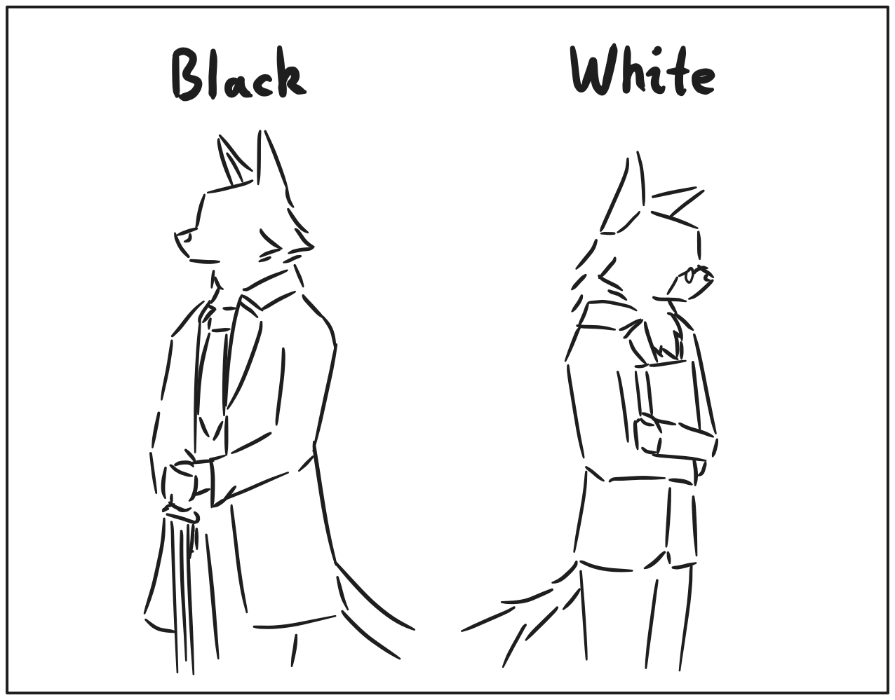

# 机制

## 介绍

- 基于国际象棋形式的游戏世界；但是游戏类型为解谜，而非国际象棋变种；
- 玩家扮演黑猫Cheshire，执黑；暹罗猫Pastor执白参与游戏；

## 阵营

- 主要有黑白两方阵营，棋子也使用黑白表示；
- 双方都能共有绝大多数的棋子种类；
- 实际棋盘布局中，双方强度不对等，部分棋盘黑方优势，也有部分是白方优势；

## Cheshire（玩家，黑方）

- 可以使用手势控制视角；
- 操作棋子时需要对准棋盘方格进行操作；
- 在“现实”中为第一人称视角，较为固定，可以在以自己的视角为前提下检阅各种物品；
- 在“回忆”中视角不固定，视角以及与棋子、棋盘的互动方式本身也可以成为一种可拓展的地方，当然，Cheshire自身也会作为棋子本身出现。

## Pastor（对手，白方）

- 承担裁判任务，在计算着法的顺便，计算玩家在规则内允许的着法；
- 裁判包含了送将判定、王车易位合法性判定（等同于送将）、棋局结束判定等；

## 回合制

- 轮流情况取决于具体规则，规则程序需要手动切换阵营。

## 棋盘

- 8 * 8正方形网格，基底与国际象棋棋盘类似；
- 棋盘周围有坐标标注；
- 颜色较浅，以灰白色为主，便于显示草稿和指令线条；
- 以3D模型形式呈现；
- 由棋盘负责指定棋子的模型；
- 制作棋盘时，需要使用Area3D指定每个格子的高度，以及点击的碰撞形状；
- 棋盘可以保存一些全局的状态，例如吃通路兵的格子、以及易位时的经过格子；
- 棋盘对象不和棋盘状态（ChessState和FEN）挂钩，可以根据已有的棋盘状态展示出不同的样貌；
- 可以使用FEN导入棋局，例如可以通过[Lichess](https://lichess.org)的谜题，复制其FEN到游戏中，测试AI性能；
- 棋盘状态也会保存成类似FEN的格式，也就是一条带空格的字符串；

## 棋子

- 包含了玩家、敌人、中立角色、道具等；
- 多个棋子不能挤在同一格子上；
- 玩家可以双击棋子查看详情和帮助文档；
- 由于记谱问题，且为了控制游戏复杂度，棋子自身没有状态，只会凭场景行事；
- 无论哪个规则，棋子是由一个32位整型数字表示，可以利用其中的部分位记录棋子的状态及其状态转移。

## 棋盘状态

- 方便起见，使用0x88表示法表示棋盘；
- 棋盘状态分为棋子分布，及额外信息（例如王车易位标志、吃过路兵标志）；
- 额外信息为整型类型，从FEN导入时必须将这些信息转换为整型；
- 棋子分布相同时认定为同一局面；
- 支持Zobrist键值，以区分不同局面；

## 规则

- 描述棋子形状、棋子行为、评价函数、搜索算法、打表运算、运行状态等核心逻辑的类；
- 性能原因，规则本身使用C++描述；

## 数据库

- 在搜索时，系统可以直接查询当前状态下的着法，以最精确最高效的方式开局；
- 着法数据以规则区分数据库文件，以初始状态（关卡）区分不同的表格，以Zobrist为键，以目前局面的着法评分为值；
- 着法必须包含最优解、可以包含本手、俗手；
- 制作数据库的过程需要写在规则中；
- 在导入外部规则和关卡时，可以将预先制作好的数据库一同导入；

## 着法

- 可以通过点击、滑动来确定着法；
- 一回合只能够指定一颗棋子，指向一次方向；
- 点击当前棋子或者拖动时，会展示所有合法操作，用高亮方框表示能指向的格子；
- 不同棋子能够指向的格子和实现的效果可能不同，例如王车易位会牵扯其他棋子移动；
- 指向合法检测，包含了棋子本身的位置检测，以及场景本身检测能否前往，不好总结，但包含了一些情况：
	1. 王车易位中的的限定规则（没有易位过、王易位前后不能被将军、经过格子不在攻击范围、中间无其他棋子、王和车需要在同一位置）
	2. 王被将军必须应将（遮挡、跑王、吃掉攻击的棋子）
	3. 被己方、对方棋子遮挡，但可以吃对方棋子
	4. 兵的开局进两步
	5. 吃过路兵（对方上一步必须是兵开局走两步）
	6. 王无法走向被控制的格子
	7. 被场景中的墙遮挡
	8. 兵的直走斜吃
- 着法的底层数据使用一个整型来表示

## 同种着法额外选项

- 由于我们需要处理兵的升变、以及比较诡异的王车易位，特此在着法上增加此类信息；
- 额外信息仍然是通过规则生成的，玩家无法自行填入；
- 若起点和终点相同，但实际导向结果不同时，则视作出现冲突，此时系统将会提供多种选项，例如升变时可以变后、车、马、象；
- 考虑到快棋规则，棋盘需要有专门的互动形式提示选择额外选项。

## 预先走子

- 为了适应子弹棋等时间限制极其苛刻的环境，设立该机制；
- 在对手的回合中，玩家仍然可以选择己方的棋子移动，只不过不会立刻生效；
- 除非着法被判定非法，预先走子会在轮到己方时自动执行；
- 由于无法保证着法是否合法，绝大多数的着法都可以尝试预先走子；
- 预先走子具体细节有多种方案，如下：
	- 为了避免误操作，只能规划未来一回合的着法（lichess.org规则）；
	- 可规划未来多个回合的预走子（chess.com规则）；
	- 先控制对手的棋子以设置“假设”，根据“假设”来落子。

## 草稿

- 可以加载指定草稿，“贴”在棋盘上；
- 允许绘制自由线条，同时以线条形式保存，以线条为单位进行擦除；
- 由于棋盘有高度差，草稿需要单独作为一个图层，绘制优先级为最高；
- 支持手写笔和压感；
- 支持文字输入；

## 棋钟

- 取决于关卡设计需求，通常情况为正计时；
- 部分情况为倒计时，对双方计时；
- 白方Pastor也需要足够的思考时间，倒计时较少，或许可以使用拖延战术击败他。

## 悔棋

- 每次悔棋都可以撤销到落子之前的状态；
- 新游戏时，玩家可以自愿选择关闭悔棋以及不限次数悔棋；
- 黑方无法通过悔棋补偿时间，但是白方能够因为对方悔棋，将自己的倒计时回退到上一步的状态；
- 这意味着悔棋所消耗的时间是黑方单方面的损失。

## 棋谱

- 用于记录双方在当前棋盘中的对局过程；
- 一份棋谱中主要保存了以下这些信息：
	1. 场上拥有棋子及其初始位置；
	2. 着法；
	3. 思考时间；
- 以关卡初始状态开始记录棋谱，离开时棋谱仍然保留；
- 棋谱中记录的时间，以“上次落子时的刻度”和“这次落子时的刻度”之间的时间差为准。
- 玩家可以随时查看历史棋谱记录，甚至可以看到Pastor对于每一步棋的评价。
	- 当然，正在进行中的对局他暂不评价。

## 局面记谱法

- 使用类似于FEN记谱法的方式，用较短的字符串表示出完整的局面；
- 其中包含了地形信息、棋子信息、全局规则等内容；
- 26个字母基本不够用，拓展的棋子可以使用单个Unicode来记录，意味着我们可以使用中文字符表示一颗棋子；
- 注意使用不同的字符来表示对应阵营，例如中国象棋中的“帅”与“将”、“兵”与“卒”、“士”与“仕”……
- 字符和对应实际棋子需要有字典映射，键为字符缩写，值为棋子对应的GDScript文件、所属阵营。
- 映射将会写在user://位置上，方便大家进行拓展，不过小心冲突，届时将会解决多种映射的问题。

## 目标

- 游戏为解谜游戏，设计关卡时小心别设计成策略游戏；
- 某一方的着法，使得对方空着后能直接获得胜利，那么这方的着法会被视为“将军”；
- 所有着法评分以及空着评分均超出斩杀线，则被视为“将死”；
- 所有着法评分超出斩杀线，但空着评分未超出斩杀线，视为“逼和”平局。

## 环境

- 特指棋盘之外的环境，包含了棋盘本身、棋钟、对手Pastor、玩家Cheshire、以及周围的布景；
- 下棋的环境是多变的，可能是咖啡厅、可能是酒馆、也可能是审讯室；
- 玩家无法离开棋盘，不过可以控制镜头，直接点击以拉近观察桌面上的事物；
	- 形式上确实很有《The Rooms》的味道，大概吧……
- 毕竟下棋不是过家家，有些心事……还得在棋盘外讲讲，你我之间。

## 博弈树

- 这一条将会描述游戏AI的具体实现，但是也会要求玩家穷尽所有着法（含剪枝规则），以解开更深层的谜题；
- 简单来讲，对于Pastor，他会以当前思考能力下最优策略进行决策；
- Pastor会使用AlphaBeta剪枝算法进行搜索；
- 为了启发搜索以及逼和判定，博弈树会包含“空着”的搜索——通过探讨某方跳过后局势如何发展。
- 必要时，还需要引入数据库，用于开局和残局，碰到类似局面时，会参考数据库的着法。

## 话题

- 平时对阵Pastor的棋局中，Pastor会在对局时展开一系列的话题。
- Pastor只会在轮到他时说话。
- 在部分回合中，玩家确认落子前会出现与话题相关的选项，夹杂在“着法”机制当中，作为对Pastor的回应。
- 看起来是Pastor主导的话题，实际上，只要尝试同样的开局，那么他会重复同样的话题，以方便玩家检查话题中夹杂的秘密。

## 局面评分

- 这里只讨论眼前的评分，不讨论思考后的结果；
- 评分需要和棋子解耦，单独编写局面函数。
- 但是考虑到性能因素，我们最好只对着法进行评价，每次都对局面进行评价，会增加较多计算开销。

## 将军和斩杀线

- 规则需要包含将军判定，将军判定回让某一方的王（以标准规则举例）标红警告。
- 这里的斩杀线指代的是评分的允许上限和允许下限。
- 在棋盘的某个状态中，一方的评分低于斩杀线时，会被视为失去目标，导致超出斩杀线的着法将不会被允许。
- 在设计规则协议中的评价系统时，达成目标的状态，其评分可以被设置成超出斩杀线的大小。

## 盘外招

- 比较遥远的饼，看着乐；
- 玩家在棋盘之外完成一些活动，在游戏棋局内获得一些增益；
- 举个例子：喝咖啡可以让时间流速稍稍变慢一些。
